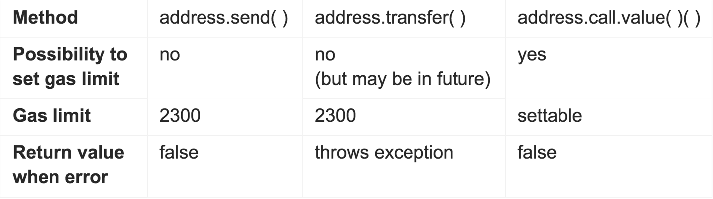
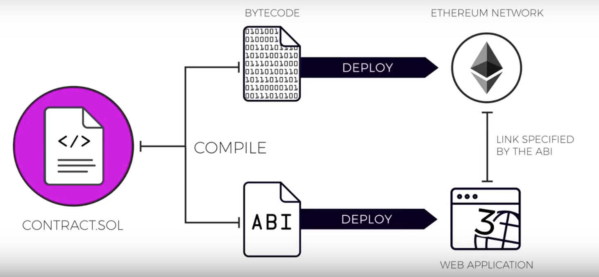
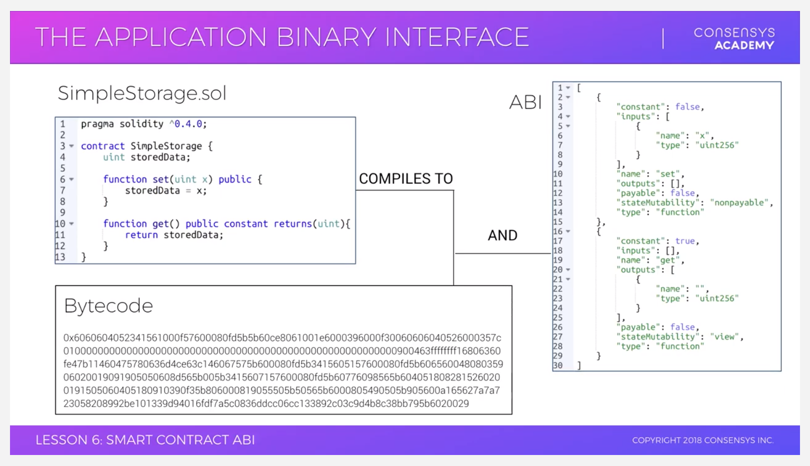

{:toc}

# Todo

- [ ] [ScottWorks' Consensys notes](https://github.com/ScottWorks/ConsenSys-Academy-Notes)

---

# How Ethereum Works

- [ ] TODO: Consensys Chap 2, 3, 4

# Environment Setup

## Geth

## Metamask

Source: [Consensys Academy Lesson](https://learn.consensys.net/unit/view/id:1906)

### Concept of Metamask

- Need way to sign a transaction w/ private key in the browser
- Metamask = chrome plugin that manages keys for user (previously: users would need to trust private keys to a website)
- Metamask injects a web3 API into websites, allows websites to read from blockchain using data,
- Metamask allows website to propose transactions to the user, shows user costs, allows user to accept or decline
- Metamask is a bridge that allows users to run Ethereum dApps in-browser without needing to run a full node

## Remix

- Browser-based Solidity IDE

### Loading local filesystem

You can connect Remix to your localhost filesystem. This is especially useful for working with truffle, where contracts are all in subfolders (or installed via `truffle install XXX`)

Folder is shared using websocket connection between Remix IDE and remixd. Remixd provides full read and write access to folder (possibly dangerous?)

https://remix.readthedocs.io/en/latest/remixd.html

```bash
remixd -s $(pwd) --remix-ide https://remix.ethereum.org
# Note: it will fail if URL contains trailing slash
```

## Deploying a Smart Contract w/o tooling

```javascript
// Start a private eth testnet (geth repl)
geth --dev console

// Check account (in geth repl)
eth.accounts[0]
eth.getBalance(eth.accounts[0])

// Create sol file (in new terminal tab)
// Grab sample solidity file from solidity docs
vi SimpleStorage.sol
// Compile using solc (solidity compiler)
echo var compiledStorage = `solc --combined-json abi,bin,interface SimpleStorage.sol` > simpleStorage.js

// Load ABI into geth repl
loadScript('simpleStorage.js')
var ABI = compiledStorage.contracts["SimpleStorage.sol:SimpleStorage"].abi

// Load binary into geth repl, add "0x" to indicate hex encoding
var bin = "0x" + compiledStorage.contracts["SimpleStorage.sol:SimpleStorage"].bin

// Deploy contract to blockchain
var deploymentTx = {
  from: eth.accounts[0],
  data: bin,
  gas: 1000000
}
var storageInterface = eth.contract(JSON.parse(ABI))
var storageInstance = storageInterface.new(deploymentTx)

// Get transaction receipts
var address = eth.getTransactionReceipt(storageInstance.transactionHash).contractAddress

// Interact with contract using contract ABI
var storage = storageInterface.at(address)
storage.get.call()
storage.set.sendTransaction(10, {
  from: eth.accounts[0],
  gas: 1000000
})

```

## Ganache

- Simulates private blockchain on local machine w/ funded accounts

### Ganache Cheatsheet

```
npm install -g ganache-cli

ganache-cli
ganache-cli -m <list of mnemonic words> // Useful for working w/ metamask, generates HD wallet addresses
```

### Ganache GUI

- Runs on `7545` instead of `8545`s

## Truffle

- **What it is**: "Ruby on Rails of smart contract development" (fml)
- Helps with:
  - Smart Contract Compilation
  - Libary Linking
  - Contract Testing
  - Transaction Debugging
  - Deployment
  - Front-end Interaction

### Truffle Structure

```javascript
/build // Created when truffle compile is run
  /contracts // compiled json ABIs
/contracts
/migrations
/test
truffle-config.js
```

### Truffle Migrations

```
// Migration scripts
// 1_initial_migration.js
```

- [ ] What does `deployer.link` do? Why does it need to link? Only library contracts?

### truffle-config.js

```javascript
// truffle-config.js
module.exports = {
  networks: {
    development: {
      host: "127.0.0.1",
      port: 8545 // should be 7545 if truffle develop
      network_id: "*"
    }
  }
}
```

#### Untracking truffle-config.js

Sometimes it's useful (e.g. if we have a HDwallet mnemonic there for Ropsten deployment)

```
// To have a different truffle-config from the rest of the repo, untrack it in local repo
git update-index --assume-unchanged truffle-config.js
```

### Truffle Commands

```
truffle init
truffle unbox metacoin

truffle compile --all // re-compiles all contracts, otherwise only those changed
truffle migrate --reset // re-deploys all contracts

truffle develop // opens up console, with live contracts deployed
// in shell
> var instance = ContractName.at(ContractName.address)
> instance.method(arg)

```

### Truffle Test:

- Uses Mocha - testing / Chai - assertions
- Can also be written in solidity but it's less ideal (quirks in Solidity - JS interaction are not accounted for)

#### Truffle Test Cheatsheet

Add to code snippet below to remember test best practices / cookbooks

```javascript
// contract function instead of describe. Contracts are re-deployed ('clean room function')

contract("MetaCoin", accounts => {
  it("should put 10000 MetaCoin in the first account", async () => {
    const metaCoinInstance = await MetaCoin.deployed();
    const balance = await metaCoinInstance.getBalance.call(accounts[0]);

    assert.equal(balance.valueOf(), 10000, "10000 wasn't in the first account");
  });
  it("should call a function that depends on a linked library", async () => {
    const metaCoinInstance = await MetaCoin.deployed();
    const metaCoinBalance = (await metaCoinInstance.getBalance.call(
      accounts[0]
    )).toNumber();
    const metaCoinEthBalance = (await metaCoinInstance.getBalanceInEth.call(
      accounts[0]
    )).toNumber();

    assert.equal(
      metaCoinEthBalance,
      2 * metaCoinBalance,
      "Library function returned unexpected function, linkage may be broken"
    );
  });
  it("should send coin correctly", async () => {
    const metaCoinInstance = await MetaCoin.deployed();

    // Setup 2 accounts.
    const accountOne = accounts[0];
    const accountTwo = accounts[1];

    // Get initial balances of first and second account.
    const accountOneStartingBalance = (await metaCoinInstance.getBalance.call(
      accountOne
    )).toNumber();
    const accountTwoStartingBalance = (await metaCoinInstance.getBalance.call(
      accountTwo
    )).toNumber();

    // Make transaction from first account to second.
    const amount = 10;
    await metaCoinInstance.sendCoin(accountTwo, amount, { from: accountOne });

    // Get balances of first and second account after the transactions.
    const accountOneEndingBalance = (await metaCoinInstance.getBalance.call(
      accountOne
    )).toNumber();
    const accountTwoEndingBalance = (await metaCoinInstance.getBalance.call(
      accountTwo
    )).toNumber();

    assert.equal(
      accountOneEndingBalance,
      accountOneStartingBalance - amount,
      "Amount wasn't correctly taken from the sender"
    );
    assert.equal(
      accountTwoEndingBalance,
      accountTwoStartingBalance + amount,
      "Amount wasn't correctly sent to the receiver"
    );
  });
});
```

### Things I've come across:

#### 4447 error when running `truffle-test`

This arises when nothing is specified in `truffle-config.js`. See [my answer on Stackoverflow](https://ethereum.stackexchange.com/questions/69286/the-network-id-specified-in-the-truffle-config-4447-does-not-match-the-one-ret/71087#71087)

## EthPM

`truffle install <pkg>` installs EthPM packages in the `installed_packages` directory

- Gotcha 1: You have to make sure all EthPM-installed packages use the same solidity compiler
- Gotcha 2: You are making replicated copies of contracts and re-deploying them, so it might cost quite a bit

* There is some stuff about EthPM v2 where you need to deploy packages yourself
* https://github.com/trufflesuite/truffle/issues/1883
* https://github.com/trufflesuite/trufflesuite.com/issues/398

## Drizzle

- Hook up to chain via Web3
- Instantiating contracts
- Keep track of data

## Estimating Gas

https://ethgasstation.info/

# Solidity

## Features of Solidity

- Statically typed (i.e. types must be specified at compile time)
- Compiled language (bytecode is executed by EVM)

## Types

### Elementary (value) types

#### Boolean

```
bool <var> = true or false
bool <var>; // initializes to false
bool public <var> // automatically creates getter function
```

##### Logical Operators

- Common short circuiting rules apply (i.e. )

```
// logical operators
! = logical negation
&& = logical conjunction
|| = logical disjunction
== = equality
!= inequality
```

#### Integer

- Default assugnment: 0

```
// Signed vs Unsigned
int
uint

// Number suffix must be multiple of 8
uint8, uint16, uint64, int256
```

#### Address

20 byte value

Two types

- address
- address payable

##### address functions

[Good article on difference between `.send`, `.transfer`, `.call`](https://medium.com/daox/three-methods-to-transfer-funds-in-ethereum-by-means-of-solidity-5719944ed6e9)

- `.send`, `.call` require 2300 gas limit to run fallback function (which is only enough to emit an event)
- **Gotcha 1:**. `send` does not throw exception on out-of-gas error (i.e. can fail silently, very dangerous!). Use `.transfer` instead
- **Gotcha 2**: `.call` is very flexible (can specify gas), but does not protect against re-entrancy attacks



```
// address functions
address.balance // balanace of addr

// address functions

address.call
// call other contracts (returns true if successful or false if exception)

address.callCode
// use delegateCall instead

address.delegatecall
// delegates function call to specified address while maintaining all aspects of calling address (i.e. storage, balance etc)

address.staticcall
```

##### address payable functions

```
// address payable
address.transfer // transfer wei to address
address.send // low level counterpart to transfer

// Casting other types to address
address(x) // needs to be 20 byte value, or contract w/ payable fallback function
```

#### Byte Arrays

```
// Fixed-size byte arrays
// between 1 and 32 bytes
byte[4] fixedArray;
fixedArray.length() // returns 4

// Dynamic-sized byte arrays
// not actually a value type
byte[] dynamicArr;
```

#### Enums

- Big gotcha: `enums` are represented as integers, i.e. index of value in `enum` declaration
- Return value will be `uint<X>`, where X will autoexpand to needed values

```javascript
pragma solidity >=0.4.16 <0.7.0;

contract test {
    enum ActionChoices { GoLeft, GoRight, GoStraight, SitStill }
    ActionChoices choice;
    ActionChoices constant defaultChoice = ActionChoices.GoStraight;

    function setGoStraight() public {
        choice = ActionChoices.GoStraight;
    }

    // Since enum types are not part of the ABI, the signature of "getChoice"
    // will automatically be changed to "getChoice() returns (uint8)"
    // for all matters external to Solidity. The integer type used is just
    // large enough to hold all enum values, i.e. if you have more than 256 values,
    // `uint16` will be used and so on.
    function getChoice() public view returns (ActionChoices) {
        return choice;
    }

    function getDefaultChoice() public pure returns (uint) {
        return uint(defaultChoice);
    }
}
```

#### Function types

- Functions can be passed params to other functions (?)

##### Types of functions

- internal vs external (internal by default)
- pure, constant, view
- payable

### Complex (reference) types

- Need to always think if we store in storage or memory

#### Arrays

```
// fixed size
array[k]
// dynamic size
array[]

// storage vs memory
array[] storage // can hold anything, including mappings
array[] memory // cannot hold mappings, but everything else is ok

// public getter function
array[] public name // needs index as param

// members
array.length() // For dynamic arrays in storage, can resize it by assigning length
array.push() // only for dynamic arrays, appends value to the array. returns new length

// creating dynamic arrays in memory
uint[] memory a = new uint[](<variable length>)
```

#### Structs

- Only restriction: cannot contain member of its own type
- Can contain mappings / arrays, and be members of mappings / arrays
- Structs stored as local vars (i.e. memory?) are passed by reference (not copied)

- [ ] Why do we sometimes need to call `new` when creating a struct?
- [ ] Why do we sometimes need a `storage` or `memory` when creating a struct

```
// Defines a new type with two fields.
    struct Funder {
        address addr;
        uint amount;
    }

    struct Campaign {
        address payable beneficiary;
        uint fundingGoal;
        uint numFunders;
        uint amount;
        mapping (uint => Funder) funders;
    }
```

##### Adding Struct to a Mapping

```

```

##### Adding a Struct to a Dynamic Array

### Mappings (i.e. hashtables)

- Hashtables
- Gotcha: every value is virtually initialized to its default (i.e. 0)
- Mappings have no length and are not iterable
- Keys in mapping are stored as `keccak256` hash of `keyValue`

```
mapping(_keyType => _valueType);
mapping(_keyType => _valueType) public; // creates getter
```

### Global Variables

```
// message
msg.data (bytes) // complete calldata
msg.gas (uint) // remaining gas
msg.sender (address) // sender of message (current call)
msg.sig (bytes4) // first four bytes of calldata
msg.value (uint) // number of wei sent with the message

// time
now (uint) // current block timestamp

// transaction
tx.gasprice (uint) // gas price of the transaction
tx.origin (address) // sender of the transaction (full call chain)

// block
block.blockhash (uint blockNum) returns bytes32 // returns hash of given block
block.coinbase (address) // returns block miner's address
block.difficulty (uint) // current block difficulty)
block.gaslimit (uint) // current block gas limit
block.number (uint) // current block number
block.timestamp (uint) // current block timestamp as unix epoch seconds. NOTE: can be manipulated by miner!
```

## Functions

```
function (<parameter types>)
  {internal|external}
  [pure|constant|view|payable]
  [returns (<return types>)]
```

### Accessibility Modifiers

```
// accessibility modifiers
public
external (only accessible from outside contract)
private (only accessible from contract)
internal (all derived contracts can access)
```

- Calling external function from within same contract (why would we do this though?)

```
pragma solidity ^0.5.0;
contract GetterSetter {
    string public name;

    function setName(string _name) external {
        name = _name;
    }

    function setNameToGeorge() public {
        this.setName("George");
    }
}
```

### Returns

```javascript
// returns
returns (string)
returns (string _name) // does not require return in function body
```

**Returning reference types**: (e.g. arrays, structs), data location must be in **memory** to be returned

```
contract Adoption {
    address[16] public pets;
    function getAdopters()
        public
        view
        returns( address[16] memory) // Specify memory in returns
    {
        return pets;
    }
}
```

### State Mutations

```
// view or constant functions does not mutate state
function getName() [constant | view]

// pure do not read or modify state
function f() pure

// payable can handle Ether
function receivePayment() payable
```

### Throwing exceptions

```
require(condition)
require(external.send(amount)) // validate response from external contract
require(block.number > SOME_BLOCK_NUM)
require(balance[msg.sender] >= amount)
```

- Validate conditions / return values
- more forgiving
- uses `0xfd` opcode to cause error
- Used towards beginning of a function

```
revert()
```

- Always throws exception
- Uses 0xfd opcode to cause error
- Undo all state changes
- Refund any remaining gas to caller

```

```

assert()
c = a+b; assert(c > b); // check for overflow
assert(this.balance <= totalSupply); // check invariants

```
* Test internal errors and check for invariants.
* Should aim to never reach a failing assert statement
* Meant to help static analyzers or formal verification tools examine contracts (see [article](https://medium.com/blockchannel/the-use-of-revert-assert-and-require-in-solidity-and-the-new-revert-opcode-in-the-evm-1a3a7990e06e))
* Steals all the gas
* uses `0xfe` opcode to cause error
* Typically used for overflow / underflow
* Used towards end of a function

### Function Modifiers

```

modifier costs(uint price) {
if (msg.value >= price) {
\_; // executes the remainder of contract
}
}

```

### Fallback Function

* [(Fallback Function docs)](https://solidity.readthedocs.io/en/v0.4.21/contracts.html#fallback-function)
* Executed when contract receives plain ether without data (fallback function must be `payable`), or when called w/ function it doesn't recognize (`.send`, `.transfer`)
* Can only rely on 2300 gas being available - cannot do a lot of things

```

function() public payable {
balance += msg.value
}

```

### Function overloading

* Can have multiple functions with same name, require different arguments
* Inherited functions: Child contract will override parent contract function

```

function f (uint \_a)
function f (uint \_a, bytes32 \_b)

```

## Storage and Memory

- [ ] [Storage, Memory and the Stack](https://solidity.readthedocs.io/en/v0.4.21/introduction-to-smart-contracts.html#storage-memory-and-the-stack): EVM is a stack machine

### Data Locations

#### Types of Data Locations

* Storage = hard drive, persists across function calls, stored on every node in the blockchain
* Memory = persists for function call
* Call stack = cheapest, but only 1024 call depth

```

state variables // storage
function arguments // memory

```

#### Specifying data location

* Most of the time data locations cannot be specified as variables are copied every time they are used
* Except for arrays, structs, mapping (important!)

```

// Following are passed by reference (i.e. modifies storage values)
array[] storage;
struct n storage;
mapping n storage;

// Make a copy with the memory keyword
struct b memory = n;

```

## Contract Structure

- [ ] [Smart Contracts as State Machines](https://solidity.readthedocs.io/en/develop/common-patterns.html?#state-machine)


```

pragma solidity ^0.5.0; // valid compiler version, need to be very careful

contract SimpleStorage { // Capitalize by convention
uint value;
event logChange()
modifier onlyOwner🇲🇲

constructor() or SimpleStorage()

sampleFunction();
// can also include inline assembly
}

```

## Reading Smart Contracts

- [ ] [Reading Smart Contracts](https://sunnya97.gitbooks.io/a-beginner-s-guide-to-ethereum-and-dapp-developme/basic-practice-reading-contracts.html)


## Smart Contract ABI

* ABI is a low-level API for the JSON RPC to interact with bytecode on-chain
* ABI de-facto method of encoding / decoding data in and out of transactions




## Events and logs

* Transaction log is a special data structure used to store past events
* Gotcha: logs cannot be accessed from contracts
* Main use 1: UI or app can update based on events
* Main use 2: Cheap form of storage (8 gas per byte, while contract storage costs 625 gas per byte)
* Adding `indexed` keyword to event params allows searchability

```

pragma solidity >= 0.5.0 < 0.6.0;
contract ExampleContract {
event LogReturnValue(address indexed \_from, int256 \_value);
function foo(int256 \_value) public returns (int256) {
emit LogReturnValue(msg.sender, \_value);
return \_value;
}
}

```

## Factory Contracts

* Solidity is not OO, but adopts some design patterns (e.g. factory design pattern)

```

contract Token {
...
}

import "./Token.sol"
contract TokenFactory {
function createToken (uint256 \_initalAmount) {
Token newToken = new Token(\_initialAmount) // Creates new instance
}
}

```

# Writing Smart Contracts

- [ ] Truffle Pet Shop tutorial
- [ ] Hitchhiker's guide to Smart Contracts
- [ ] Create a Multisig wallet

## Inter-contract Execution

* Contracts are viewed as first class members in Ethereum
* Externally-owned accounts (i.e. )

### Referencing another contract
```

pragma solidity ^0.4.1;

contract C1 {
uint x;
function C1() public {
x = 10;
}
function setX(uint \_x) public returns(bool) {
x = \_x;
return true;
}
function getX() public constant returns(uint) {
return x;
}
}

contract C2 {
function f2(address addrC1)
public
constant
returns(uint)
{
// Referencing an existing contract at an address
C1 c1 = C1(addrC1);
return c1.getX();
}
}

````

### Call vs CallCode vs DelegateCall

* `.call` or `.callcode`: `msg.sender` is the calling contract, storage and state are from child contract
* `.delegatecall`: `msg.sender` is original `tx.origin`, and storage and state are from parent contract

* Solidity uses `bytes4(sha3("setNum(uint256)"))` under the hood to create function signature when calling another contract. Is equivalent of getting instance of C2 contract, calling setNum function. First 4 bytes of sha3 of functions signature

```javascript
c2.call(bytes4(sha3("setNum(uint256)"))

// is the equivalent of
C2 c2 = C2(_c2);
c2.setNum(_num);
````

```javascript
pragma solidity ^0.4.15;

contract C1 {
  uint public num;
  address public sender;

  function callSetNum(address c2, uint _num) public {
    if(!c2.call(bytes4(sha3("setNum(uint256)")), _num)) revert(); // C2's num is set
  }

  function c2setNum(address _c2, uint _num) public{
      C2 c2 = C2(_c2);
      c2.setNum(_num);
  }

  function callcodeSetNum(address c2, uint _num) public {
    if(!c2.callcode(bytes4(sha3("setNum(uint256)")), _num)) revert(); // C1's num is set
  }

  function delegatecallSetNum(address c2, uint _num) public {
    if(!c2.delegatecall(bytes4(sha3("setNum(uint256)")), _num)) revert(); // C1's num is set
  }
}

contract C2 {
  uint public num;
  address public sender;

  function setNum(uint _num) public {
    num = _num;
    sender = msg.sender;
    // msg.sender is C1 if invoked by C1.callcodeSetNum
    // msg.sender is C3 if invoked by C3.foo()
  }
}

contract C3 {
    function f1(C1 c1, C2 c2, uint _num) public {
        c1.delegatecallSetNum(c2, _num);
        // sets C1's msg.sender to C3
        // sets C1's num to _num b/c delegateCall
    }
}
```

### Inheritance

- Derived contract inherits state and functions, can override functions
- Only a single contract is created on blockchain, i.e. all code is compiled into created contract
- Use `super` to call nearest inherited contract, or by explicitly calling the contract name wanted (e.g. `mortal.kill()`)
- **Gotcha:** B

```javascript
pragma solidity >=0.5.0 <0.7.0;


contract Owned {
    constructor() public { owner = msg.sender; }
    address payable owner;
}
contract Mortal is Owned {
    function kill() public {
        if (msg.sender == owner) selfdestruct(owner);
    }
}

// These abstract contracts are only provided to make the
// interface known to the compiler.
contract Config {
    function lookup(uint id) public returns (address adr);
}
contract NameReg {
    function register(bytes32 name) public;
    function unregister() public;
}

contract Named is Owned, Mortal {
    constructor(bytes32 name) public {
        // Uses abstract contract
        Config config = Config(0xD5f9D8D94886E70b06E474c3fB14Fd43E2f23970);
        NameReg(config.lookup(1)).register(name);
    }

    // Functions can be overridden by another function with the same name and same number/types of inputs.
    function kill() public {
        if (msg.sender == owner) {
            Config config = Config(0xD5f9D8D94886E70b06E474c3fB14Fd43E2f23970);
            NameReg(config.lookup(1)).unregister();
            // It is still possible to call a specific
            // overridden function.
            Mortal.kill();
        }
    }
}


// If a constructor takes an argument, it needs to be
// provided in the header (or modifier-invocation-style at
// the constructor of the derived contract (see below)).
contract PriceFeed is Owned, Mortal, Named("GoldFeed") {
    function updateInfo(uint newInfo) public {
        if (msg.sender == owner) info = newInfo;
    }

    function get() public view returns(uint r) { return info; }

    uint info;
}
```

#### Linearization of inheritance

- Order is from "most base like" to "most derived"
- `contract A is X, Y, Z` means that Z is the most derived contract (i.e. overrides previous)

```javascript
contract X {}
contract A is X {}
contract C is A, X {} // will not compile
```

### Abstract Contracts

- Can be used as a base contract and extended, but does not have function implementations. Does not compile
- Most used to interface with external contracts

```javascript
contract Feline {
  function utterance() public returns (bytes32);
}
contract Cat is Feline {
  function utterance() public returns (bytes32) { return "meow"; }
}
```

### Interface Contracts

- Limited to what the Contract ABI represents

```javascript
interface Token {
  function transfer(address receipient, uint amount) public;
}
```

## Libaries

- Exist for code reuse - allow library functions to modify state of calling contract (i.e. `delegatecall`)
- No storage variables are defined (do not have state)
- GOTCHA: can define struct data type, but will not be saved in storage until implemented in contract
- GOTCHA: calling library function is more expensive than calling internal function (in exchange for cheaper deployment)

```javascript
deployer.deploy(LibA);
deployer.link(LibA, ContractB);
deployer.deploy(ContractB);
```

```javascript
var ENS = artifacts.require("ens/ENS");
var MyContract = artifacts.require("MyContract");

module.exports = function(deployer) {
  // Only deploy ENS if there's not already an address already.
  // i.e., don't deploy if we're using the canonical ENS address,
  // but do deploy it if we're on a test network and ENS doesn't exist.
  deployer.deploy(ENS, { overwrite: false }).then(function() {
    return deployer.deploy(MyContract, ENS.address);
  });
};
```

[Good Overview of Libraries and Solidity](https://blog.aragon.org/library-driven-development-in-solidity-2bebcaf88736/)

### EthPM

- Just import in `.sol` file
- Can pubish library (similar to NPM). Add a `ethpm.json` in root directory

```
truffle install <pkgname>
```

# Smart Contract Security

## Re-entrancy attack

- [ ] [Good explanation on Re-entrancy](https://medium.com/@gus_tavo_guim/reentrancy-attack-on-smart-contracts-how-to-identify-the-exploitable-and-an-example-of-an-attack-4470a2d8dfe4)

* **Gist:** Setting balance to 0 only after a `.call` can be taken advantage of, as `.call` only terminates after entire transaction sequence. This can be taken advantage of by a recursive fallback function

```
if (!msg.sender.call.value(balances[msg.sender])()) {
      throw;
}
balances[msg.sender] = 0;
```

# Concepts

## Metatransactions

## Plasma

- [ ] Build a Plasma chain tutorial https://medium.com/@dan_30977/new-chainshot-tutorial-plasma-mvp-a80629841936

# Cookbooks

## Time-based contract

https://ethereum.stackexchange.com/questions/413/can-a-contract-safely-rely-on-block-timestamp

## Commit-Reveal Scheme

- Voters vote, submit hash. When revealing vote, it is only accepted if hash matches salt and vote.
- Examples: Colony

- [ ] Colony Blogs [1](https://blog.colony.io/towards-better-ethereum-voting-protocols-7e54cb5a0119/). [2](https://blog.colony.io/token-weighted-voting-implementation-part-2-13e490fe1b8a/), [3](https://blog.colony.io/token-weighted-voting-implementation-part-1-72f836b5423b/)

## End-to-end encryption of content

- [ ] https://medium.com/fluidity/keyspace-end-to-end-encryption-using-ethereum-and-ipfs-87b04b18156b

## Multisig wallet

- [ ] https://blog.unchained-capital.com/a-simple-safe-multisig-ethereum-smart-contract-for-hardware-wallets-a107bd90bb52?gi=e275d8a751e2
- [ ] https://blog.gridplus.io/toward-an-ethereum-multisig-standard-c566c7b7a3f6
- [ ] https://medium.com/@yenthanh/list-of-multisig-wallet-smart-contracts-on-ethereum-3824d528b95e

## Metatransactions

- [ ] https://medium.com/coinmonks/gasless-transactions-f75382095c4f
- [ ] Talk to Austin Griffith

## Key Management

- ERC725: on-chain key management
- [ ] https://medium.com/coinmonks/crypto-ux-and-key-management-6e35b3cd466d

## Using OpenZeppelin Contracts

```shell
init truffle
npm install openzeppelin-solidity
npm install all dependencies that openzep-solidity uses
```

- All `.sol` files will be in `node_modules`

## Crowdsale

Just use the OpenZeppelin contracts. Industry standard

### Variants:

1. **Validation**: CappedCrowdsale, WhitelistedCrowdsale (only allow whitelisted participants), TimedCrowdsale (i.e. from X to Y time)

2. **Distribution**: Default (release tokens once contribution made), RefundableCrowdsale

3.

Tokens

- Map addresses to balances

ERC20

- mapping(address => uint256) is fungible
- ERC20.sol implements, IERC20 is the interface, ERC20Detailed adds optional ERC20Detailed

ERC20 Burnable - allows you to burn the token (i.e. a donation?)
ERC20 Capped - allows you to say that there is a maximum cap on tokens

SafeERC20

ERC721

- Represent ownership that is non-fungible (e.g. company shares = common stock vs investor shares)
- IERC721 Receiver: contract needs to know how to handle ERC721 tokens
- each token has a tokenURI that resolves to a JSON document that has name, description, image

ERC20 vs ERC223 vs ERC777

- Cannot send funds to a smart contract account using `transfer`, which results in a successful transaction but contract never receives tokens
- ERC223 proposal: checks if `transfer` is sending tokens to a smart contract, will throw error as a result
